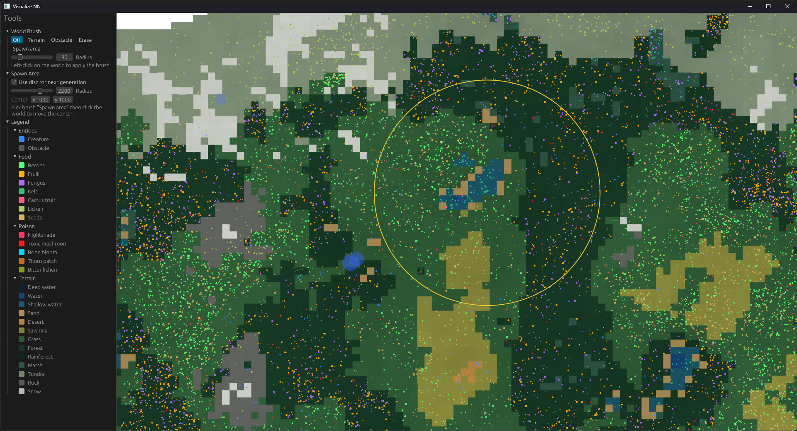
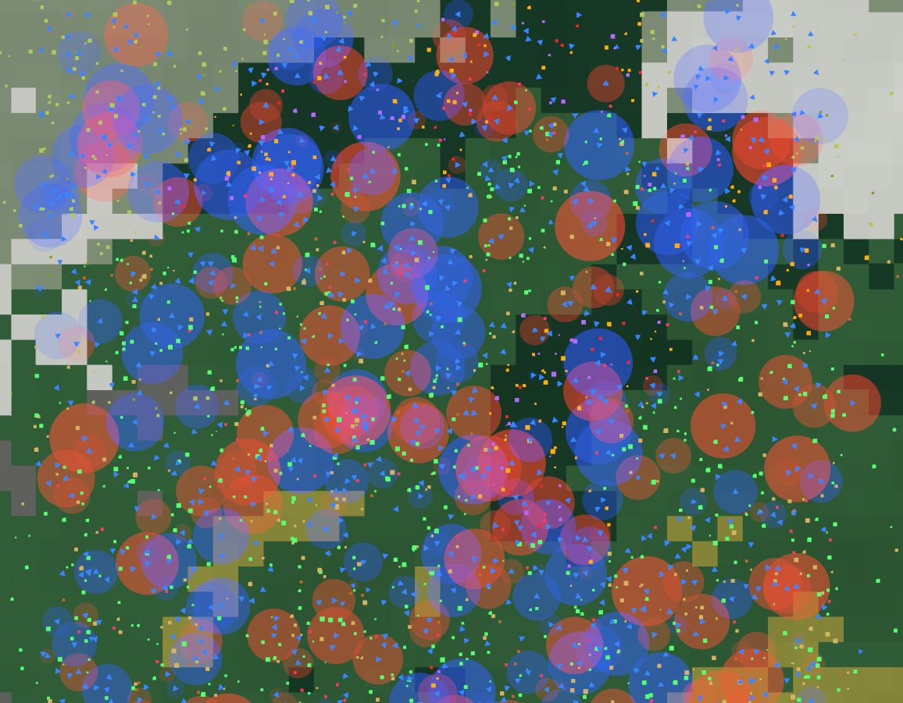
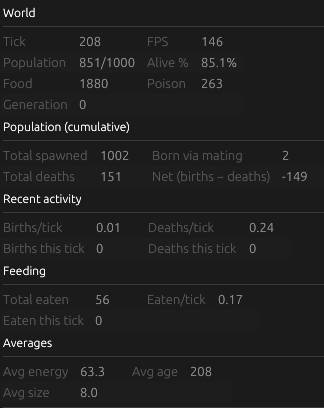
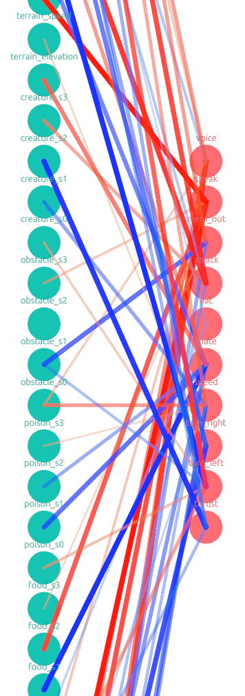
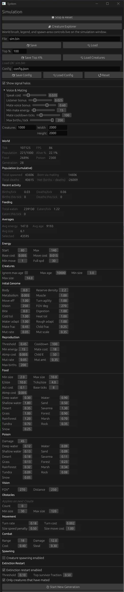

<h1 align="center">simulation</h1>
<p align="center">
  
</p>

<p align="center">
  A GPU-accelerated neuroevolution sandbox. Watch populations of creatures grow brains from scratch, learn to forage, avoid poison, dodge predators, and talk to each other — all in real time.
</p>



## Features
* **Evolved neural-net brains** — every creature is wired by a graph network that mutates and crossovers across generations (weight/bias jitter, AddEdge, AddNeuron, RemoveEdge, RemoveNeuron at equal odds)
* **GPU compute pipeline** — sensor pass and brain forward pass run on `wgpu` compute shaders, scaling to thousands of creatures per tick
* **52 sensory inputs** — hunger, health, age, heading, oscillator, proprioception, 4-sector vision for food/poison/obstacles/creatures, terrain elevation/speed/cost/hazard (local + 4-sector lookahead), food & poison odor/color, and 4-sector voice signal
* **10 motor outputs** — thrust, turn-left, turn-right, speed, mate, eat, attack, memory, speak (gated), voice (evolved scalar message)
* **Creature-to-creature voice channel** — speak action gates an evolved scalar onto nearby listeners; speakers spend energy, listeners gain a small bonus, mates that both speak get a reproduction synergy
* **Procedural terrain** — seeded heightfield with per-tile speed multiplier, energy cost, and hazard damage
* **Live config** — every simulation knob (energy budgets, mutation rate/amount, food/poison spawn rates, signal cost, mate threshold, max births/tick, etc.) is editable on the fly via egui sidebar
* **Creature inspector** — click any creature to see its full neural graph in a separate window, color-coded by node type and weighted edge magnitude
* **Save/load** — persist whole simulations or just the top-N% oldest creatures to seed future runs
* **Debug overlays** — signal halos, FOV cones, terrain visualization, all toggleable
* **Stats panel** — live population, births/deaths, survival rate, food/poison counts, food eaten, generation counter

## Configuration
All simulation parameters are live-editable through the egui sidebar at runtime — no config file needed for normal operation.

For seed/initial values, edit `config.json` at the project root, or the `SimulationConfig` defaults in [`sim/src/sim/resources.rs`](sim/src/sim/resources.rs).

The brain I/O layout (input and output nodes) is defined in [`sim/src/main.rs`](sim/src/main.rs) — add or remove nodes here to extend the sensorium or action set.

## Building
Requires a Vulkan/DX12/Metal-capable GPU and Rust stable.

```
cargo build --release
cargo run --release
```

For benchmarks of the GPU sensor + brain pipeline:
```
cargo bench -p sim
```

## Workspace layout
* `engine/` — neural-net core: `NeuralGraph`, mutation/reproduction primitives, activations, generic Net forward pass
* `sim/` — Bevy app, GPU compute pipelines (`brain_compute.wgsl`, `sensor_compute.wgsl`), simulation loop, world rendering, egui UI
* `macros/` — derive macros for neuron metadata

## Controls
* **Middle-click drag** — pan camera
* **Scroll wheel** — zoom
* **Left-click creature** — select & inspect brain
* **Sidebar sliders** — tune parameters live; changes apply on next tick

## Tech stack
* [bevy](https://bevyengine.org/) — ECS / windowing
* [wgpu](https://wgpu.rs/) — compute shaders for sensors and brain forward pass
* [bevy_egui](https://github.com/vladbat00/bevy_egui) — runtime config UI and inspector
* [bevy_vector_shapes](https://github.com/Idedary/bevy_vector_shapes) — 2D shape rendering

## Screenshots









